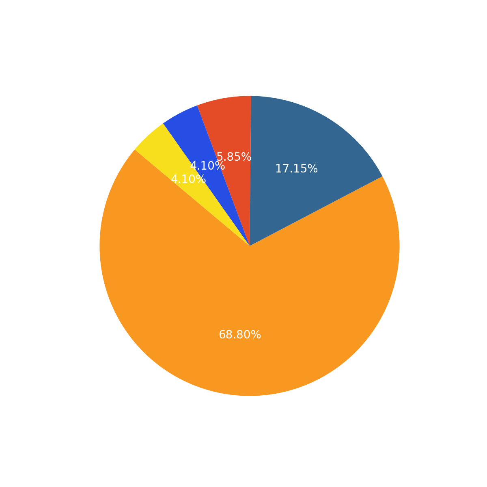

<h1 align="center">Hey 👋, I'm Aman Tiwari</h1>
<h3 align="center">Java Backend Developer | Spring Boot | SQL | AWS | DSA Enthusiast</h3>

  

---

## 🧾 Profile Summary

Full Stack Developer with hands-on experience in backend development using Java, Spring Boot, and PostgreSQL. Strong grasp of OOP principles, REST API design, and scalable software architecture. Solved over **450+ DSA problems** across platforms like LeetCode, GFG, NeetCode, and AccioPortal. Passionate about building impactful systems and writing clean, maintainable code.

---

## 🎓 Academic Background

- **B.Tech in Computer Science Engineering** – Techno India University, Kolkata (2020–2024)  
  📊 CGPA: **8.34 / 10**  
- **Higher Secondary (Science)** – St. Mary’s Convent School, Sagar (2020)  
  📈 Percentage: **80%**

---

## 🧰 Core Tech Stack

---

## 💼 Project Portfolio

### 🛒 [Grocery Delivery System](https://github.com/Amantiwarie/shopping_delivery)
> **Stack:** Spring Boot, PostgreSQL, React  
> Designed a multi-role grocery delivery system with cart, warehouse control, delivery tracking, and analytics dashboard.

---

### 🏥 [Hospital Management System](https://github.com/Amantiwarie/Hospital-Management-System)
> **Stack:** Java, Spring Boot, MySQL, HTML/CSS  
> Built a role-based secure platform for managing doctors, patients, room allocation, and staff logins with reporting.

---

### 💰 [Splitwise LLD](https://github.com/Amantiwarie/SplitwiseLLD)
> **Stack:** Java (OOP Design)  
> Implemented core logic for expense splitting using modular object-oriented architecture.

---

## 📈 Development Metrics
<h3 align="center">🔥 Current GitHub Streak:</h3>

  <!-- GitHub Streak -->
  
    

  <!-- Total Commits -->
  
    

  <!-- Top Languages Pie Chart -->
  

---

  

---

<h2 align="center" style="font-size:28px">🚀 <strong>Building today what others use tomorrow.</strong> 🚀</h2>

---

## 🔗 Connect With Me

